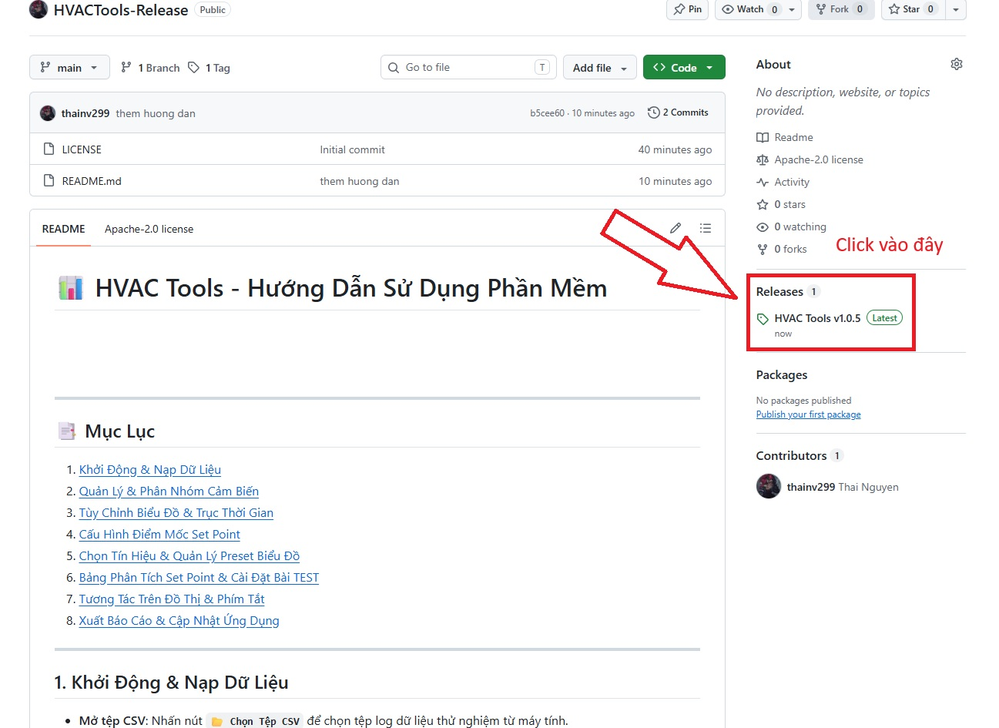
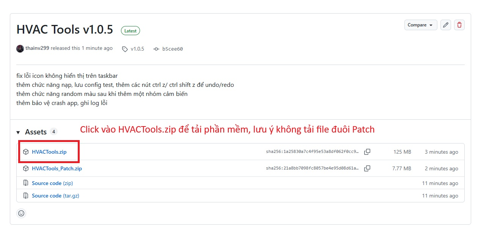
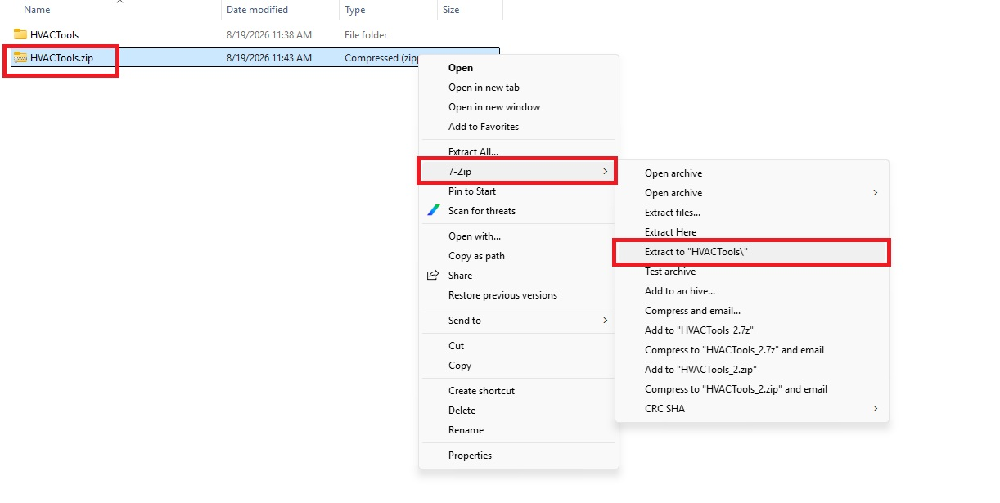
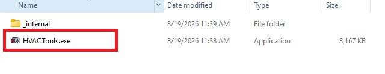

# 📊 HVAC Tools - Hướng Dẫn Sử Dụng Phần Mềm

---

## 📑 Mục Lục
1. [Hướng dẫn tải ứng dụng](#1-hướng-dẫn--tải-ứng-dụng)
2. [Khởi Động, Nạp & Quản Lý Dữ Liệu Tệp](#2-khởi-động-nạp--quản-lý-dữ-liệu-tệp)
3. [Quản Lý & Phân Nhóm Cảm Biến](#3-quản-lý--phân-nhóm-cảm-biến)
4. [Tùy Chỉnh Biểu Đồ & Trục Thời Gian](#4-tùy-chỉnh-biểu-đồ--trục-thời-gian)
5. [Cấu Hình Điểm Mốc Set Point](#5-cấu-hình-điểm-mốc-set-point)
6. [Chọn Tín Hiệu & Quản Lý Preset Biểu Đồ (Save As)](#6-chọn-tín-hiệu--quản-lý-preset-biểu-đồ-save-as)
7. [Vẽ Biểu Đồ Trên Giao Diện & Xử Lý Nền](#7-vẽ-biểu-đồ-trên-giao-diện--xử-lý-nền)
8. [Bảng Phân Tích Set Point & Tiêu Chí Đánh Giá](#8-bảng-phân-tích-set-point--tiêu-chí-đánh-giá)
9. [Tương Tác Trên Đồ Thị & Phím Tắt](#9-tương-tác-trên-đồ-thị--phím-tắt)
10. [Xuất Báo Cáo & Cập Nhật Ứng Dụng](#10-xuất-báo-cáo--cập-nhật-ứng-dụng)

---

## 1. Hướng dẫn tải ứng dụng
### - **Bước 1** : Click vào phần HVAC_Tools ở bên dưới Release

### - **Bước 2** : Click vào HVAC_Tools.zip để tải file nén phần mềm

### - **Bước 3** : Giải nén ứng dụng

### - **Bước 4** : Click chọn file HVACTools.exe để khởi chạy phần mềm
### Lưu ý : Lần đầu tiên chạy phần mềm sẽ phải giải nén các thư viện, nên sẽ mất khoảng vài giây.

---

## 2. Khởi Động, Nạp & Quản Lý Dữ Liệu Tệp

- **Nạp tệp mới (CSV / Excel)**: Nhấn nút **`📂 Chọn Tệp CSV / Excel`** trên thanh công cụ Header để nạp tệp dữ liệu thử nghiệm (hỗ trợ cả `.csv`, `.xlsx`, `.xls`, `.xlsm`, `.xlsb`).
- **Tự động nhận diện Sheet Excel**: Nếu tệp Excel chứa từ 2 Sheet trở lên, phần mềm sẽ tự động bật hộp thoại cho phép bạn chọn đúng Sheet dữ liệu cần phân tích.
- **Nạp thêm tệp dữ liệu (Multi-file)**: Bạn có thể nạp thêm tệp dữ liệu thứ 2, 3... vào bài phân tích. Ứng dụng tự động quy đổi mốc thời gian về gốc tương đối $t=0$ để so sánh song song.
- **Hộp thoại "Quản Lý Tệp 📁"**:
  - Nhấn nút **`Quản Lý Tệp 📁`** để mở bảng quản lý danh sách toàn bộ các tệp đã nạp.
  - Cho phép thay đổi Sheet Excel riêng cho từng tệp hoặc gỡ bỏ tệp bất kỳ.
  - **Cấu hình thời gian độc lập từng tệp**: Tùy chỉnh chế độ **`📁 Cột Time từ tệp`** hoặc **`⏱️ Tính theo Hz`** và nhập **Tần số lấy mẫu (Sampling Hz)** riêng rẽ cho từng tệp mà không làm ảnh hưởng tới mốc thời gian của tệp khác.
- **Cảnh báo không có cột Time**: Nếu tệp nạp vào không chứa cột `Time` hợp lệ, ứng dụng sẽ tự động bật hộp thoại cảnh báo và gợi ý chuyển sang chế độ nạp theo Hz.

---

## 3. Quản Lý & Phân Nhóm Cảm Biến

Giao diện cột bên trái (**Sensors**) cho phép gom các cảm biến nhiệt độ riêng lẻ thành các nhóm đại diện (VD: *Exhaust pipe skin, Rear muffler, Engine block, Generator...*):

- **Tạo nhóm mới**:
  1. Nhập **Tên nhóm mới** (VD: `Exhaust pipe skin`).
  2. Chọn **Đơn vị đo** (`Temp (°C)`, `Speed (km/h)`, `Force (N)`, `Pressure (bar)`, `RPM`, `Other`).
  3. Chọn các cảm biến từ cây **"Cảm biến chưa gán"** (giữ `Ctrl` hoặc `Shift` để chọn nhiều).
  4. Nhấn nút **`➕ Thêm Nhóm`**.
  *(💡 Màu đại diện sẽ tự động được hệ thống phối ngẫu nhiên đẹp mắt và chống trùng lặp)*.
- **Bổ sung / Di chuyển cảm biến**: 
  - Kéo thả (Drag & Drop) trực tiếp cảm biến lẻ hoặc **nguyên thư mục tệp** vào nhóm mục tiêu trong cây cấu trúc nhóm.
- **Đổi màu / Đổi đơn vị / Xóa nhóm**:
  - Nhấp chuột phải vào nhóm trong cây cấu trúc để mở menu ngữ cảnh (Đổi màu, Đổi đơn vị, Đổi tên, Xóa nhóm).
  - Nhấp trực tiếp vào ô màu nhỏ bên cạnh tên nhóm để thay đổi màu đường đồ thị.

---

## 4. Tùy Chỉnh Biểu Đồ & Trục Thời Gian

Tại mục **Chart (Cấu hình đồ thị & trục thời gian)**:
- **Tiêu đề đồ thị**: Nhập tên bài test (VD: *Thermal Analysis Chart*).
- **Đơn vị thời gian trục X**: Chọn hiển thị theo **`Phút (min)`**, **`Giây (s)`** hoặc **`Giờ (h)`**.
- **Bước nhảy lưới thời gian (Interval)**: Nhập khoảng cách bước chia giữa các vạch chia lưới (VD: `5.0` phút).
- **Giới hạn trục X (Xmin - Xmax)**: Nhập khoảng thời gian cần tập trung quan sát hoặc để trống để tự động bao phủ toàn bộ bài test.
- **Trục Y chính / phụ (Dual Y-Axes)**: Phân bố hiển thị các nhóm tín hiệu lên Trục tung Trái (Left Axis) và Trục tung Phải (Right Axis).
- **Trục Y từ 0 / Max-Min**: Tùy chọn cố định gốc tọa độ từ 0 và đánh dấu các điểm cực trị Max/Min kèm nhãn giá trị trực tiếp trên đường biểu diễn.

---

## 5. Cấu Hình Điểm Mốc Set Point

Tại mục **Setpoints (Cấu hình mốc thời gian đánh giá)**:
- **Số lượng mốc Set Point**: Nhập số lượng mốc cần theo dõi (từ `1` đến `10` điểm: *A, B, C, D...*) hoặc bấm **`➕ Thêm`** để tạo nhanh từng mốc.
- **Vị trí & Đơn vị Set Point**: Nhập mốc thời gian cụ thể và chọn đơn vị tương ứng (`min`, `s`, `hr`) cho từng mốc. Nhấn nút 🗑️ để xóa mốc dư thừa.
- **Hiển thị trên biểu đồ**: Tích chọn **`Vẽ lên đồ thị`** để hiển thị các đường gióng đứng kèm cờ cọc Set Point (*SP A, SP B...*).
- **Hiển thị thông số đa tệp (Multi-file Tooltips)**: Khi vẽ lên đồ thị, mỗi đường vạch Set Point sẽ tự động tính toán và hiển thị đầy đủ nhãn giá trị của **tất cả các nhóm cảm biến (thuộc nhiều tệp khác nhau)** với thuật toán chống đè chữ thông minh (Stagger Offset).

---

## 6. Chọn Tín Hiệu & Quản Lý Preset Biểu Đồ (Save As)

Tại mục **Signals (Danh sách tín hiệu vẽ đồ thị)**:
- **Lọc tín hiệu**: Ô tìm kiếm nhanh 🔍 giúp tìm nhanh tên nhóm tín hiệu.
- **Chọn tất cả / Bỏ chọn tất cả**: Nhấn nút **`✓ Chọn tất cả`** hoặc **`✗ Bỏ chọn tất cả`** để thao tác nhanh.
- **💾 Lưu Preset (Save As)**: Nhấn nút **`💾 Lưu Preset`** ở thanh Header – phần mềm sẽ **luôn bật hộp thoại Save As** cho phép bạn chọn vị trí thư mục và đặt tên tệp `.json` mới để lưu lại toàn bộ cấu hình nhóm, màu sắc, setpoint, đơn vị và tín hiệu đã chọn.
- **📂 Nạp Preset**: Nhấn nút **`📂 Nạp Preset`** để nạp lại cấu hình đã lưu. Thuật toán tự động khớp tên cảm biến thông minh kể cả khi tệp nạp có hoặc không có tiền tố `[F1]`, `[F2]`.

---

## 7. Vẽ Biểu Đồ Trên Giao Diện & Xử Lý Nền

- **Tính toán mượt mà dưới nền**: Khi bạn thực hiện bất kỳ thao tác chỉnh sửa cấu hình nào (thay đổi setpoint, chọn tín hiệu, đổi đơn vị...), ứng dụng sẽ thực hiện tính toán dữ liệu ngầm dưới luồng nền QThread mà **không làm giật lag giao diện canvas**.
- **Vẽ lên giao diện khi bấm nút**: Biểu thị đồ thị trực quan chỉ được vẽ lên màn hình bên phải khi bạn chủ động bấm nút **`🚀 Vẽ Đồ Thị (Draw Chart)`**.

---

## 8. Bảng Phân Tích Set Point & Tiêu Chí Đánh Giá

Nhấn nút **`Phân Tích Set Point`** trên thanh điều khiển biểu đồ để mở cửa sổ phân tích chuyên sâu:

### A. Đọc kết quả phân tích
- Bảng tổng hợp chi tiết giá trị thực tế của từng nhóm cảm biến (từ nhiều file khác nhau) tại chính xác mốc thời gian Set Point (*SP A, SP B...*).
- **Độ chênh lệch Deviation**: Tính chênh lệch nhiệt độ $\text{Max} - \text{Min}$ trong cùng nhóm để đánh giá độ đồng đều phân bố nhiệt.
- **Tốc độ thay đổi nhiệt độ ($\Delta T / \Delta t$)**: Tính tốc độ tăng/giảm nhiệt (°C/phút) giữa các mốc Set Point liên tiếp.

### B. Thiết Lập Tiêu Chí Đánh Giá (`⚙️ Cài Đặt Bài TEST`)
Trong bảng phân tích, nhấn **`⚙️ Cài Đặt Bài TEST`** để cài đặt quy tắc PASS / FAIL:
- **Thiết lập điều kiện (Rules)**: Chọn nhóm cảm biến, chọn phép so sánh ($\le, <, \ge, >, =, \ne$) và nhập ngưỡng nhiệt độ cho từng Set Point.
- **📋 Sao chép luật**: Sao chép nhanh bộ quy tắc của 1 Set Point sang toàn bộ các Set Point khác.
- **💾 Lưu / 📂 Nạp Preset Bài TEST**: Lưu và nạp riêng bộ quy tắc tiêu chí đánh giá ra file `.json`.

---

## 9. Tương Tác Trên Đồ Thị & Phím Tắt

| Thao Tác | Phím Tắt / Chuột | Chức Năng |
| :--- | :--- | :--- |
| **Kéo mốc Set Point** | Bấm giữ chuột trái vào cờ/đường Set Point | Kéo di chuyển trực tiếp mốc thời gian trên đồ thị (Bảng phân tích sẽ cập nhật tức thì) |
| **Phóng to / Thu nhỏ** | Cuộn chuột giữa HOẶC `Ctrl +` / `Ctrl -` | Zoom in / Zoom out theo vị trí con trỏ chuột |
| **Di chuyển đồ thị (Pan)** | Bấm giữ chuột phối hoặc nút Pan | Kéo trượt vùng hiển thị đồ thị |
| **Khôi phục góc nhìn** | Nhấn biểu tượng 🏠 (Home) | Đưa biểu đồ về kích thước đầy đủ ban đầu |
| **Hoàn tác (Undo)** | `Ctrl + Z` | Khôi phục lại thao tác cài đặt trước đó |
| **Làm lại (Redo)** | `Ctrl + Shift + Z` / `Ctrl + Y` | Làm lại thao tác vừa Undo |
| **Lưu nhanh đồ thị** | Biểu tượng 💾 (Save) trên toolbar | Lưu đồ thị thành tệp ảnh (.png, .jpg, .svg, .pdf) |

---

## 10. Xuất Báo Cáo & Cập Nhật Ứng Dụng

- **Xuất dữ liệu đã tính toán**: Nhấn **`Xuất Dữ Liệu`** để xuất toàn bộ dữ liệu đã được ghép nhóm và tính toán mốc thời gian ra tệp Excel `.xlsx` hoặc `.csv`.
- **Xuất bảng phân tích**: Trong cửa sổ Set Point Analysis, nhấn **`Xuất Bảng Ra Excel (.xlsx)`** để xuất báo cáo đánh giá kết quả.
- **Kiểm tra bản cập nhật**:
  - Ứng dụng tự động kiểm tra phiên bản mới từ GitHub Releases khi khởi động.
  - Khi có bản nâng cấp, nút thông báo đỏ **`🔴 Bản mới vX.X.X`** sẽ xuất hiện ở góc trên bên phải Header. Nhấn vào để xem thông tin chi tiết và cập nhật tự động.
- **Nhật ký sự cố (Crash Logs)**: File log được lưu tự động trong thư mục `logs/` và tự động dọn dẹp sau 7 ngày.

---

*Phát triển bởi THAINV30, DỰA TRÊN NỀN TẢNG CỦA TUANNQ38, GÓP Ý BY LONGHV9*
